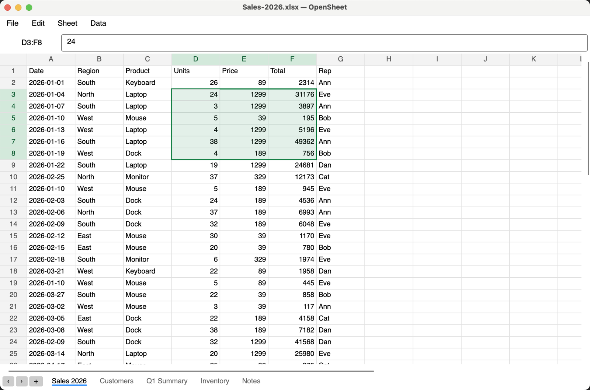

<div align="center">


# OpenSheet

**A fast, free, open-source editor for `.xlsx` and `.csv` on macOS and Windows. No Microsoft Excel, no account, no cloud.**

[](https://github.com/thanakorn1999/opensheet/actions/workflows/ci.yml)
[](https://github.com/thanakorn1999/opensheet/releases/latest)
[](LICENSE)


[**Download**](#download) · [Features](#features) · [Shortcuts](#keyboard-shortcuts) · [Build from source](#build-from-source)



</div>

Open a spreadsheet, fix it, clean up duplicates, save it. OpenSheet is a lightweight desktop app for everyday `.xlsx` and `.csv` work. It opens quickly, runs entirely on your computer, and never uploads your files.

## Download

Get the latest build from **[Releases](https://github.com/thanakorn1999/opensheet/releases/latest)**:

| Platform | File |
|---|---|
| macOS, Apple Silicon (M1–M4) | [`OpenSheet-macOS-arm64.zip`](https://github.com/thanakorn1999/opensheet/releases/latest/download/OpenSheet-macOS-arm64.zip) |
| macOS, Intel | [`OpenSheet-macOS-x64.zip`](https://github.com/thanakorn1999/opensheet/releases/latest/download/OpenSheet-macOS-x64.zip) |
| Windows 10/11 (64-bit) | [`OpenSheet-Windows-x64.zip`](https://github.com/thanakorn1999/opensheet/releases/latest/download/OpenSheet-Windows-x64.zip) |

Everything is bundled, so you don't need to install .NET.

<details>
<summary><b>macOS says the app "can't be opened" or "is damaged"</b></summary>

The app isn't notarized by Apple yet. Move it to Applications, then either right-click it → **Open** → **Open**, or run:

```bash
xattr -dr com.apple.quarantine "/Applications/OpenSheet.app"
```
</details>

<details>
<summary><b>Windows shows "Windows protected your PC"</b></summary>

The exe isn't code-signed yet. Click **More info** → **Run anyway**.
</details>

## Features

**Editing**
- Edit right in the cell: start typing, double-click, or press F2
- Formulas (`=SUM(B:B)`, `=D2*E2`, …). While typing one, **click or drag** cells, column headers or row headers to insert the reference
- Undo / redo for everything, including deleted rows and sheets
- Cut, copy and paste ranges. Formulas shift like in Excel, and paste works with blocks copied from Excel or Google Sheets

**Selecting and navigating**
- Click or drag column and row headers to select whole columns or rows; drag or Shift+click to select ranges; Cmd/Ctrl+A for everything
- Cmd/Ctrl+Arrow jumps to the edge of the data; Find (Cmd/Ctrl+F) searches the sheet
- Right-click menus on cells, headers and sheet tabs

**Cleaning data**
- **Find duplicates** by one or more columns. Matching rows are highlighted, then you can delete them all, keep one of each, or copy or move them to a new sheet
- Insert and delete rows and columns. Formulas and hyperlinks follow

**Sheets and files**
- Opens and saves **`.xlsx` and `.csv`**. CSV files can use commas, semicolons or tabs. Thai and other non-English text works both ways, and CSVs are saved so Excel reads them correctly
- Add, rename (double-click the tab), duplicate, delete, and **drag tabs to reorder** sheets
- Drop another `.xlsx` or `.csv` onto the window to open it, **import its sheets**, or **append its rows** to the current sheet
- Open from Finder or Explorer, drag & drop, Save / Save As. The app asks before you lose unsaved changes

## Keyboard shortcuts

Cmd on macOS, Ctrl on Windows.

| Keys | Action |
|---|---|
| Cmd+O / Cmd+S / Cmd+Shift+S | Open / Save / Save As |
| Cmd+Z / Cmd+Shift+Z (or Cmd+Y) | Undo / Redo |
| Cmd+X / Cmd+C / Cmd+V | Cut / Copy / Paste |
| Delete or Backspace | Clear selection |
| Type, F2, or double-click | Edit cell |
| Enter / Tab (+Shift to go back) | Save the edit and move down / right |
| Esc | Cancel the edit or close a bar |
| Arrows, Page Up/Down, Home | Move |
| Cmd+Arrow | Jump to the edge of the data |
| Cmd+Home | Go to A1 |
| Shift+Arrow, Shift+click, drag | Extend the selection |
| Cmd+A | Select all |
| Cmd+Page Down / Page Up | Next / previous sheet |
| Shift+F11 | New sheet |
| Cmd+F, then Enter / Shift+Enter | Find next / previous |

## Build from source

Needs the [.NET 10 SDK](https://dotnet.microsoft.com/download).

```bash
git clone https://github.com/thanakorn1999/opensheet.git
cd opensheet
dotnet run --project src/OpenSheet.App   # run it
dotnet test                               # run the tests
```

**macOS app** (`publish/OpenSheet.app`):

```bash
./build-mac.sh             # build for this Mac
./build-mac.sh --install   # build and copy to /Applications
RID=osx-x64 ./build-mac.sh # build for Intel Macs
```

To make it the default for `.xlsx` (or `.csv`), select one in Finder, press Cmd+I, set **Open with** to *OpenSheet*, then click **Change All…**.

**Windows exe** (one file in `publish/win`; this also works when run from a Mac or Linux):

```bash
dotnet publish src/OpenSheet.App -c Release -r win-x64 --self-contained \
  -p:PublishSingleFile=true -p:IncludeNativeLibrariesForSelfExtract=true -o publish/win
```

The app icon is generated by `python3 assets/make-icon.py` (needs Pillow).

## How it works

- `src/OpenSheet.Core` holds the workbook logic, with no UI. It wraps [ClosedXML](https://github.com/ClosedXML/ClosedXML) and handles undo, ranges, duplicates, import and CSV.
- `src/OpenSheet.App` is the [Avalonia](https://avaloniaui.net/) desktop app. The grid draws only the visible cells, so large sheets stay smooth.
- `tests/OpenSheet.Core.Tests` has the xUnit tests that run on every push.

## Limitations

Not there yet:
- Formatting tools (bold, colors, number formats). Existing formatting is kept when you save
- Real column widths and row heights
- Charts, pivot tables and images. ClosedXML may not keep all of them when saving, so use **Save As** on files that have them

Issues and pull requests are welcome.

## License

[MIT](LICENSE). Avalonia and ClosedXML are MIT-licensed too.
